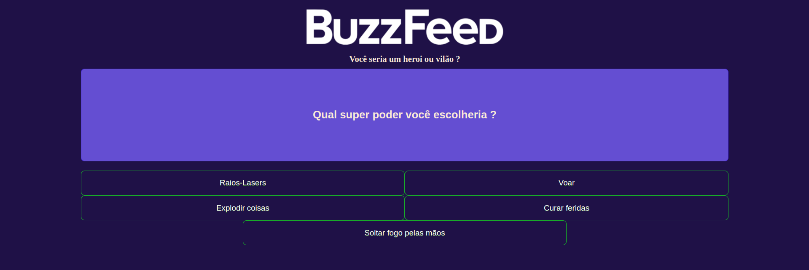

# BuzzFeed Project

This project made with [Angular version 14.1.2](https://v14.angular.io/docs).

## Local run

First Clone the repositorie

> git clone git@github.com:Pedrobolfute/Angular-BuzzFeed.git

Run `ng serve` for a dev server. Navigate to `http://localhost:4200/`. The application will automatically reload if you change any of the source files.

## Project View for Desktop

## Project View for Smartphone

